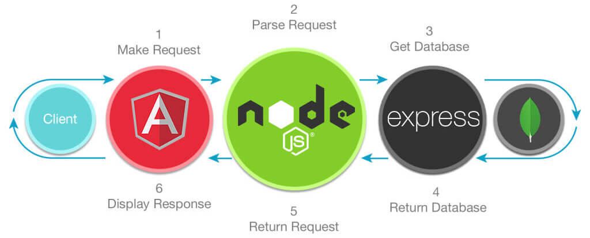

# Acoustic data
MEAN Project + Angular Universal
 

    

## Versions
* MongoDB v3.6.2 (Mongoose v5.0.9)
* Express v4.16.2
* Angular v5.2.8
* Node.js v9.7.1

## Installation
1. Clone this repo
1. `cd` into the folder of the cloned repo
1. Run `yarn install` to install dependencies
1. Start your local MongoDB instance
1. Choose to run the development or production server
    * Development
        * Front End (Angular)
            * Run `ng serve`, and navigate to `http://localhost:4200/`. 
        * Back End (MongoDB, Express, Node.js)
            * Run `yarn run dev`, and navigate to `http://localhost:3000/`.
    * Production
        * Run `yarn start`, and navigate to `http://localhost:3000/`.

## Built-in scripts
* `yarn run dev`
    * Builds the Angular project into the `dist/` folder without build optimization
    * Builds the Angular Universal server into the `dist-server/` folder without build optimization
    * Runs the `server.js` node app
* `yarn run build`
    * Builds the Angular project into the `dist/` folder
    * Builds the Angular Universal server into the `dist-server/` folder
* `yarn start`
    * Runs `yarn run build` as above
    * Runs the `server.js` node app

## Installed Packages
### Front-end
* Angular 5
* Angular Universal
* [Angular Material](https://material.angular.io/)
* [Bulma CSS Framework](https://bulma.io/)
* [Font-Awesome 5](https://fontawesome.com/)

### Back-end
* Express
* Mongoose

### Development and Testing
* Angular CLI v1.7.2
* Morgan Logging library
* Typescript
* Karma
* Protractor
* Jasmine

### Starter Kit
[MEAN Starter Kit w/ Angular Universal](https://github.com/stanleyeosakul/mean-starter-kit)
